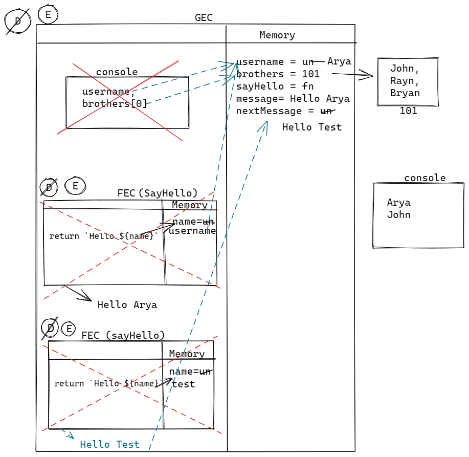
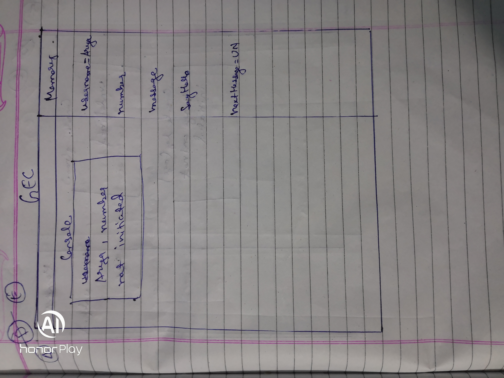
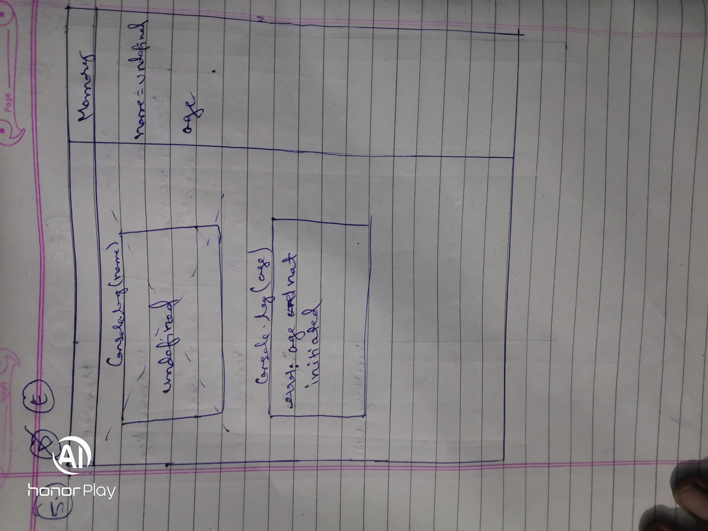
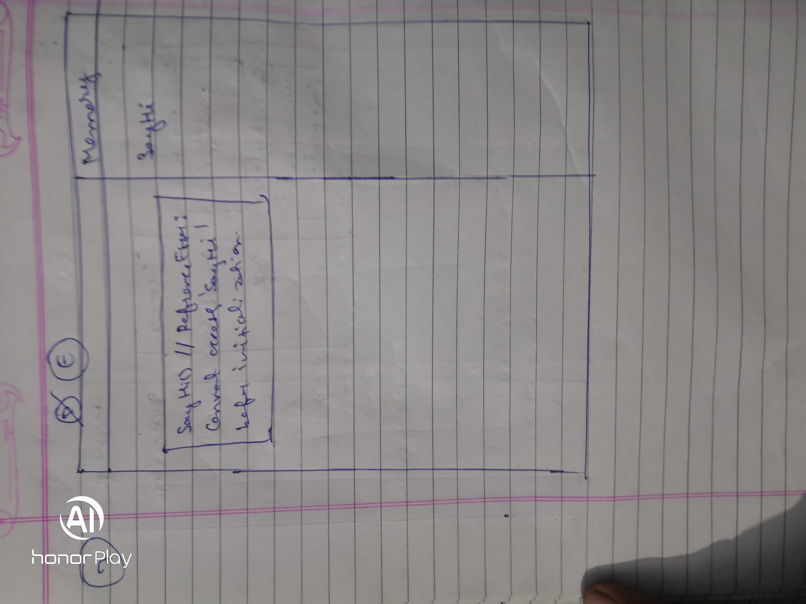

For the given code below:

- create the execution context diagram
- re-write the code in ways that system will understand/interprete

1.

```js
var username = 'Arya';
let brothers = ['John', 'Ryan', 'Bran'];

console.log(username, brothers[0]);

function sayHello(name) {
  return `Hello ${name}`;
}

let message = sayHello(username);
var nextMessage = sayHello('Test');
```

## Interprete
```js
// Declaration phase

var username;
let brothers;

function sayHello(name) {
  return `Hello ${name}`;
}

let message;
var nextMessage;

// Execution phase

username = 'Arya';
brothers = ['John', 'Ryan', 'Bran'];

console.log(username, brothers[0]); // "Arya", "John"

message = sayHello(username);
nextMessage = sayHello('Test');
```
2.

```js
console.log(username, numbers);

var username = 'Arya';
let number = 21;

function sayHello(name) {
  return `Hello ${name}`;
}

let message = sayHello(username);
var nextMessage = sayHello('Test');
```

## Interprete

```js
// Declaration Phase

var username = undefined;
let number;

function sayHello(name) {
  return `Hello ${name}`;
}

let message;
var nextMessage = undefined;

// Execution phase

console.log(username, numbers); // undefined, ReferenceError: Cannot access 'number' before initialization

```

3.

```js
console.log(username, numbers);

let username = 'Arya';
let number = 21;

let sayHello = function (name) {
  return `Hello ${name}`;
};

let message = sayHello(username);
var nextMessage = sayHello('Test');
```

## Interpret
```js
// Declaration phase
let username;
let number;

let sayHello;
let message;
var nextMessage = undefined;

// Execution phase
console.log(username, numbers);//  ReferenceError: Cannot access 'username' before initialization, ReferenceError: Cannot access 'number' before initialization  
```
4.

```js
let username = 'Arya';
console.log(username, numbers);

let number = 21;
let message = sayHello(username);

let sayHello = function (name) {
  return `Hello ${name}`;
};

var nextMessage = sayHello('Test');
```

## Interpret
```js
// Declaration phase
let username;
let number;
let message;
let sayHello;
var nextMessage = undefined;
// Execution phase
username = 'Arya';
console.log(username, numbers);// Arya, ReferenceError: Cannot access 'number' before initialization
```
5.

```js
console.log(name);
console.log(age);
var name = 'Lydia';
let age = 21;
```

## Interpret
```js
// Declaration phase
var name = undefined;
let age;
// Execution phase
console.log(name);// undefined;
console.log(age); //  ReferenceError: Cannot access 'age' before initialization
```
6.

```js
function sayHi(name) {
  console.log(name);
  console.log(age);
  var name = 'Lydia';
  let age = 21;
}

sayHi();
```

# Interpret
```js
//Declaration phase
function sayHi(name) {
 //Declaration phase
 var name = undefined;
 let age;
 // Execution phase
 console.log(name); // undefined;
 console.log(age); // ReferenceError: Cannot access 'age' before initialization
}
// Execution phase
sayHi();
```
6.

```js
sayHi();
function sayHi(name) {
  console.log(name);
  console.log(age);
  var name = 'Lydia';
  let age = 21;
}
```

## Interpret
```js
//Declaration phase
function sayHi(name) {
 //Declaration phase
 var name = undefined;
 let age;
 // Execution phase
 console.log(name); // undefined;
 console.log(age); // ReferenceError: Cannot access 'age' before initialization
}
// Execution phase
sayHi();
```
7.

```js
sayHi();
let sayHi = function sayHi(name) {
  console.log(name);
  console.log(age);
  var name = 'Lydia';
  let age = 21;
};
```

## Interpret
```js
let sayHi;

sayHi() // ReferenceError: Cannot access 'sayHi' before initialization
```
8.

```js
let num1 = 21;
console.log(sum);
var sum = num1 + num2;
let num2 = 30;
```

## Interpret
```js
//declaration phase
let num1;
var sum = undefined;
let num2;
// execution phase
num1 = 21;
console.log(sum);// undefined
sum = num1 + num2;// Refrence error: Cannot access 'num2' before initialization
```
9.

```js
var num1 = 21;

let sum2 = addAgain(num1, num2, 4, 5, 6);

let add = (a, b, c, d, e) => {
  return a + b + c + d + e;
};
function addAgian(a, b) {
  return a + b;
}
let num2 = 200;

let sum = add(num1, num2, 4, 5, 6);
```

## Interpret
```js
//Declaration phase
var num1 = undefined;
let sum2;
let add;
function addAgian(a, b) {
  return a + b;
}
let num2;
let sum;
// Execution phase
num1 = 21;
sum2 = addAgain(num1, num2, 4, 5, 6); // Refrence error: Cannot access 'num2' before initialization
```
10.

```js
function test(a) {
  let num1 = 21;
  return add(a, num1);
}

let sum = test(100);

let add = (a, b) => {
  return a + b;
};
```

## Interpret
```js
//declaration
function test(a) {
  let num1 = 21;
  return add(a, num1);
}
let sum;
let add;
// Execution
sum = test(100); // Refrence error: Cannot access 'add' before initialization

```

11.

```js
function test(a) {
  let num1 = 21;
  return add(a, num1);
}

let sum = test(100);

function add(a, b) {
  return a + b;
}
```

## Interpret
```js
// Declaration phase
function test(a) {
  let num1 = 21;
  return add(a, num1);
}
let sum;
function add(a, b) {
  return a + b;
}
// Execution phase
sum = test(100) // 121
```